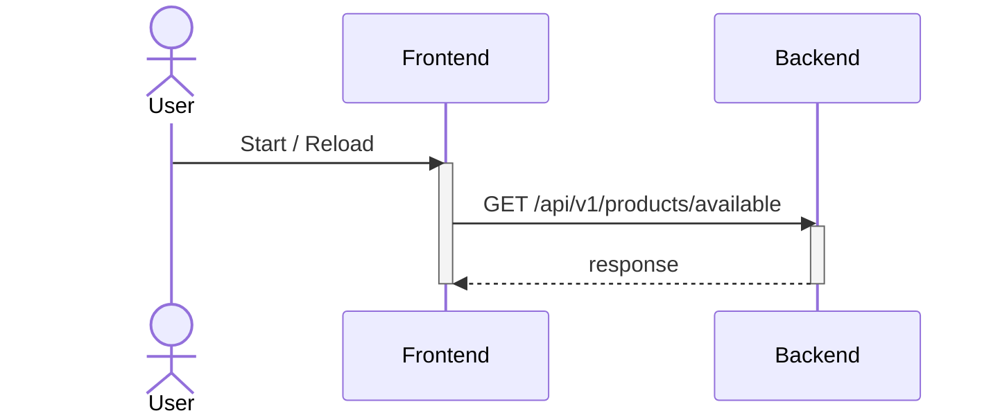
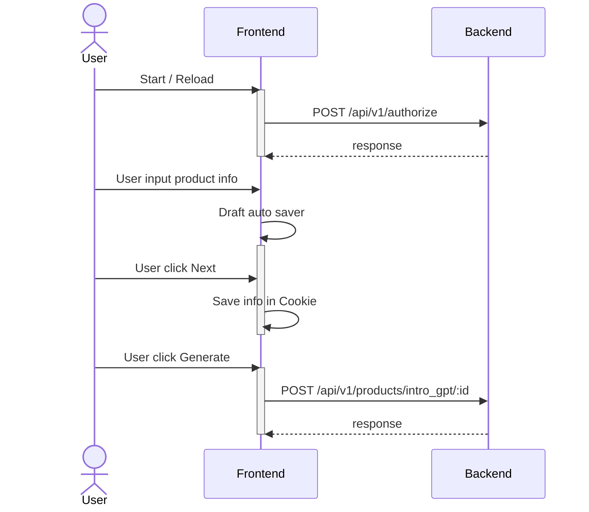
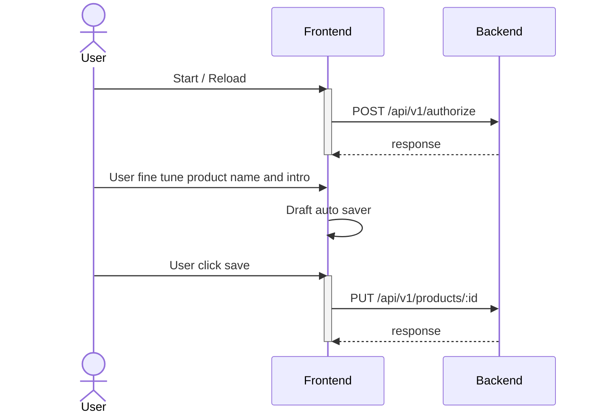

# brainstorm-web

This is a small project for looking for the possibility to save artist time or increasing conversion rate, in different way.

Current scenario is the tool will help artist to generate a better product intro.

### Technical Features

- [NextJS](https://nextjs.org/)
- [React-Query](https://tanstack.com/query/latest)
- [Axios](https://github.com/axios/axios)
- [React-Hook-Form](https://react-hook-form.com/)
- [zustand](https://github.com/pmndrs/zustand)

### Dev Environment Setup

- Clone this repository
  - `git clone https://github.com/dychendavid/brainstorm-web`
- Go to the directory
  - `cd brainstorm-web`
- Install node modules
  - `npm install`
- Create .env and setup API url, replace XXX depends on your environment
  - `echo "NEXT_PUBLIC_API_URL=xxx" >> .env`
  - Local: http://127.0.0.1:3001
  - Production: https://brainstorm-api-545bd2c50ee9.herokuapp.com
- Execute
  - `npm run dev`

### Sequence Diagram

#### Home Page

#### Wizard Page

#### Editor Page

